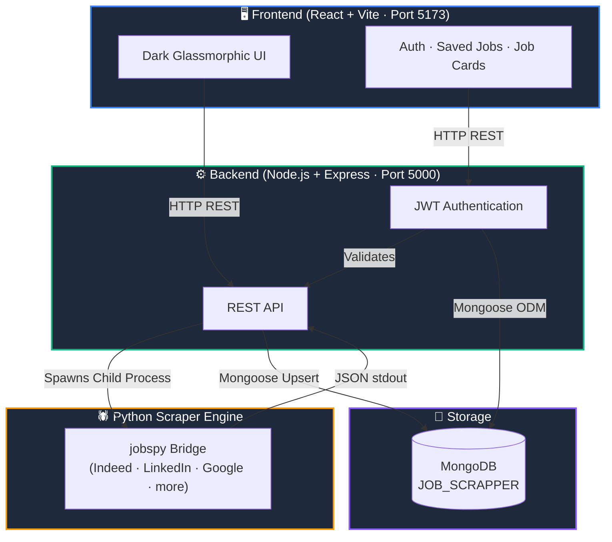

# 🚀 JOB_FINDER — Full-Stack Multi-Platform Job Scraper & Management System

A modern full-stack web application for scraping, storing, and managing live job listings from multiple job boards. Built with **React + Vite**, **Node.js + Express**, **MongoDB**, and a **Python `jobspy` bridge** — all connected through a clean REST API pipeline with no file-based intermediaries.

---

## 📸 Architecture Overview



**Data Pipeline (no CSV, no temp files):**
```
User Search → POST /api/jobs/scrape → Python scraper.py → JSON stdout → MongoDB upsert → GET /api/jobs → React UI
```

---

## 🛠️ Tech Stack

| Layer | Technology |
|---|---|
| **Frontend** | React 18, Vite, Vanilla CSS (glassmorphic design system) |
| **Backend** | Node.js, Express 4, JWT (jsonwebtoken), bcryptjs |
| **Database** | MongoDB (Mongoose ODM) |
| **Scraper** | Python 3.10+, `python-jobspy`, pandas |
| **Auth** | JWT — 7-day tokens, bcrypt password hashing |

---

## 📁 Project Structure

```
JOB_FINDER/
├── README.md
├── main.py                        ← Standalone Tkinter desktop launcher
├── tests/                         ← Test suite
├── backend/
│   ├── server.js                  ← Express entry point (Port 5000)
│   ├── package.json
│   ├── middleware/
│   │   └── authMiddleware.js      ← JWT verification middleware
│   ├── models/
│   │   ├── Job.js                 ← Scraped jobs schema (unique on job_url)
│   │   ├── SavedJob.js            ← User saved jobs schema
│   │   └── User.js               ← User auth schema (bcrypt hashed password)
│   ├── routes/
│   │   ├── auth.js               ← POST /register · POST /login · GET /me
│   │   ├── jobs.js               ← POST /scrape · GET / · DELETE /
│   │   └── savedJobs.js          ← Saved jobs CRUD
│   └── scraper/
│       └── scraper.py            ← Headless Python jobspy bridge (JSON stdout)
└── frontend/
    ├── package.json
    ├── vite.config.js
    ├── index.html
    └── src/
        ├── App.jsx               ← Main routing + API integration
        ├── main.jsx
        ├── index.css             ← Complete glassmorphic design system
        └── components/
            ├── AuthPage.jsx      ← Login & Registration (register → sign-in redirect)
            ├── Header.jsx        ← Navigation, user menu, DB status
            ├── SearchForm.jsx    ← Scraper control: search, location, sites, results
            ├── StatsPanel.jsx    ← Metric cards (total, 24h, by platform)
            ├── FilterBar.jsx     ← Live search, platform filter & sort
            ├── JobCard.jsx       ← Job card with save, expand, apply
            ├── JobList.jsx       ← Paginated job grid
            └── SavedJobsPage.jsx ← User's saved jobs with 3-day countdown
```

---

## ⚡ Quick Start

### Prerequisites

- **Node.js** v18+
- **Python 3.10+** with jobspy:
  ```bash
  pip install -U python-jobspy pandas
  ```
- **MongoDB** running locally on port `27017`

---

### 1 — Start MongoDB

Ensure MongoDB is running and accessible at:
```
mongodb://localhost:27017/JOB_SCRAPPER
```

---

### 2 — Start the Backend

```bash
cd backend
npm install
npm run dev
```

Backend starts at **`http://localhost:5000`**

---

### 3 — Start the Frontend

In a new terminal:

```bash
cd frontend
npm install
npm run dev
```

Open **`http://localhost:5173`** in your browser.

---

## 🔌 API Reference

### Jobs

| Method | Endpoint | Description |
|--------|----------|-------------|
| `POST` | `/api/jobs/scrape` | Trigger Python scraper, upsert results to MongoDB |
| `GET` | `/api/jobs` | List jobs — supports `search`, `site`, `sortBy`, `page`, `resultsWanted` |
| `GET` | `/api/jobs/stats` | Aggregate stats: total, 24h count, platform breakdown, top companies |
| `DELETE` | `/api/jobs/:id` | Remove a single job by ID |
| `DELETE` | `/api/jobs` | Clear all jobs from MongoDB |

#### `POST /api/jobs/scrape` — Request Body

```json
{
  "search_term": "software engineer",
  "location": "San Francisco, CA",
  "country": "USA",
  "results_wanted": 20,
  "hours_old": 72,
  "sites": ["indeed", "linkedin"],
  "google_query": ""
}
```

**Supported sites:** `indeed`, `linkedin`, `google`, `zip_recruiter`, `glassdoor`, `naukri`, `bayt`, `bdjobs`

---

### Authentication

| Method | Endpoint | Description |
|--------|----------|-------------|
| `POST` | `/api/auth/register` | Create account → returns success (no auto-login, must sign in) |
| `POST` | `/api/auth/login` | Authenticate → returns JWT token |
| `GET` | `/api/auth/me` | Get current user profile (requires `Authorization: Bearer <token>`) |

---

### Saved Jobs

| Method | Endpoint | Description |
|--------|----------|-------------|
| `GET` | `/api/saved-jobs` | Get user's saved jobs (auth required) |
| `POST` | `/api/saved-jobs` | Save a job (auth required) |
| `GET` | `/api/saved-jobs/check/:jobId` | Check if a job is saved |
| `DELETE` | `/api/saved-jobs/:id` | Unsave a job |

---

## 🌐 Supported Job Platforms

| Platform | Region | Notes |
|---|---|---|
| **Indeed** | Global | Best coverage |
| **LinkedIn** | Global | Professional roles |
| **Google Jobs** | Global | Aggregated listings |
| **ZipRecruiter** | USA | May require proxy |
| **Glassdoor** | USA | May require proxy |
| **Naukri** | India | India-specific |
| **Bayt** | UAE / Middle East | Regional |
| **BDJobs** | Bangladesh | Regional |

> **Note:** For India searches, problematic sites (ZipRecruiter, Glassdoor, Bayt, Naukri, BDJobs) are automatically skipped and the scraper falls back to Indeed + LinkedIn.

---

## 🔐 Authentication Flow

1. **Register** → Account created; user is redirected to the **Sign-In tab** to explicitly log in
2. **Login** → JWT token issued (7-day expiry), stored in `localStorage`
3. **Protected routes** → Dashboard (`/`) and Saved Jobs (`/saved`) require authentication
4. **Token verification** → On app load, token is verified via `GET /api/auth/me`

---

## 🏗️ Key Design Decisions

| Decision | Rationale |
|---|---|
| **No CSV output** | All data flows via JSON stdout → MongoDB. No temp files written to disk. |
| **Upsert on `job_url`** | Prevents duplicate MongoDB records across repeated scrapes |
| **Register → Sign-In redirect** | Users must explicitly log in after registration (security best practice) |
| **Python child process** | Keeps Python dependencies isolated from the Node.js process |
| **72-hour job TTL** | Jobs older than 72 hours are excluded from the listing query by default |
| **Fallback site groups** | Scraper retries with safe site subsets if an initial group fails |

---

## 🔮 Roadmap

1. **📡 Real-time Scrape Streaming** — Replace HTTP polling with Server-Sent Events (SSE) to stream live scraper progress to the UI
2. **⏰ Scheduled Auto-Scraping** — `node-cron` jobs that auto-scrape predefined roles every 6–12 hours with email digest notifications
3. **📋 Application Tracker Kanban** — Trello-style board: `Saved → Applied → Interviewing → Offer → Rejected`
4. **🤖 AI Resume Match Score** — Gemini/OpenAI integration to parse a resume and score job match % per listing
5. **🛡️ Proxy Rotation** — ScraperAPI / rotating proxy pool support in `scraper.py` for high-volume scraping without IP blocks
6. **📊 Export to Excel / PDF** — One-click download of filtered job results as `.xlsx` or PDF

---

## 📄 License

[MIT](LICENSE)
