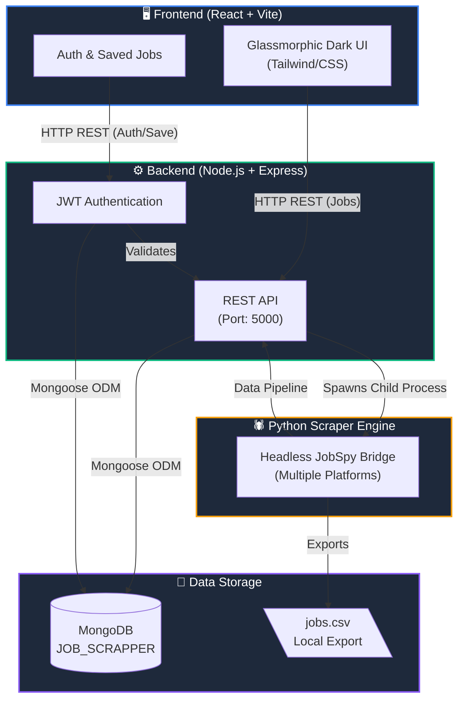

# 🚀 JOB_SEARCH — Full-Stack Multi-Platform Job Scraper & Management System

A powerful full-stack web application and job scraping suite built with **React**, **Node.js + Express**, **MongoDB**, and **Python (`jobspy`)**. It scrapes live job listings from multiple platforms (Indeed, LinkedIn, Google Jobs, ZipRecruiter, Glassdoor, Naukri, Bayt, Bdjobs), normalizes data, avoids duplicates, and persists job records into **MongoDB** and `jobs.csv`.

---

## 📸 Overview & Architecture



---

## 🛠️ Project Analysis & What Changed

### 1. Legacy Architecture vs. Upgraded System
- **Original (`main.py` & `app.py`)**: A local desktop GUI built with Python `tkinter` that scraped jobs into a plain `jobs.csv` file without persistence, search filtering, or web accessibility.
- **Upgraded System**: A modern full-stack web application featuring:
  - **Decoupled Python Bridge (`scraper.py`)**: Headless scraper script accepting CLI arguments, filtering entry-level jobs, and returning structured JSON to Node.js.
  - **Express REST API (`server.js`)**: Serves endpoint APIs, manages asynchronous Python process spawning, upserts jobs to MongoDB, and synchronizes `jobs.csv`. Additionally, it handles JWT Authentication and Saved Jobs.
  - **MongoDB Database**: Persistent storage at `mongodb://localhost:27017/JOB_SCRAPPER` with unique indexing on `job_url` to prevent duplicate listings.
  - **React Frontend**: Built with Vite and custom glassmorphic CSS tokens (`index.css`), live stat counters, job search & location parameters, platform checkboxes, salary details, user authentication, and saved job management.

---

## 📁 Repository Directory Structure

```
JOB_FINDER/
├── README.md                      ← Primary project documentation
├── main.py                        ← Original Tkinter desktop app (Legacy)
├── app.py                         ← Original app launcher (Legacy)
├── jobs.csv                       ← Auto-generated CSV containing scraped job links
├── backend/                       ← Node.js + Express API
│   ├── package.json               
│   ├── server.js                  ← Express server entry point (Port 5000)
│   ├── middleware/
│   │   └── authMiddleware.js      ← JWT verification middleware
│   ├── models/
│   │   ├── Job.js                 ← Scraped Jobs Schema
│   │   ├── SavedJob.js            ← User Saved Jobs Schema
│   │   └── User.js                ← User Auth Schema
│   ├── routes/
│   │   ├── auth.js                ← Authentication routes (Login/Register)
│   │   ├── jobs.js                ← Scraper & Jobs REST API 
│   │   └── savedJobs.js           ← User saved jobs API
│   └── scraper/
│       └── scraper.py             ← Headless Python bridge script (JobSpy)
└── frontend/                      ← React + Vite Web App
    ├── package.json               
    ├── vite.config.js             
    ├── index.html
    └── src/
        ├── App.jsx                ← Main routing & API integration
        ├── main.jsx
        ├── index.css              ← Dark glassmorphic design system
        └── components/
            ├── AuthPage.jsx       ← Login & Registration forms
            ├── Header.jsx         ← Navigation, Auth status & DB connection
            ├── SearchForm.jsx     ← Scraper control form
            ├── StatsPanel.jsx     ← Metric cards
            ├── FilterBar.jsx      ← Live search, platform filter & sorting
            ├── JobCard.jsx        ← Glassmorphic job card (Save/Apply)
            ├── JobList.jsx        ← Paginated job grid
            └── SavedJobsPage.jsx  ← User's saved jobs dashboard
```

---

## ⚡ Quick Start & Installation Guide

### Prerequisites
- **Node.js** (v18+ recommended)
- **Python 3.10+** with `python-jobspy` installed (`pip install -U python-jobspy pandas`)
- **MongoDB** running locally on default port `27017`

### 1. Database Setup
Ensure MongoDB service is active:
```bash
# Verify connection to:
mongodb://localhost:27017/JOB_SCRAPPER
```

### 2. Start Backend Server
```bash
cd backend
npm install
npm start
```
*Backend will start on `http://localhost:5000`.*

### 3. Start Frontend App
In a new terminal window:
```bash
cd frontend
npm install
npm run dev
```
*Open `http://localhost:5173` in your browser.*

---

## 🔌 API Reference Endpoints

| Method | Endpoint | Description |
|--------|----------|-------------|
| `POST` | `/api/jobs/scrape` | Trigger Python scraper with search parameters, save to MongoDB & `jobs.csv` |
| `GET` | `/api/jobs` | Retrieve stored jobs (Supports `search`, `site`, `sortBy`, `page`, `limit`) |
| `GET` | `/api/jobs/stats` | Fetch aggregate DB statistics (total jobs, 24h count, site breakdown) |
| `DELETE`| `/api/jobs/:id` | Delete a specific job record by ID |
| `DELETE`| `/api/jobs` | Clear all job records from MongoDB and reset `jobs.csv` |

---

## 🔮 Recommended Future Upgrades & Roadmap

Here are recommended high-value features for future iterations:

1. **📡 Real-time Scrape Streaming (WebSockets / SSE)**:
   - Replace standard HTTP polling with Server-Sent Events (SSE) or Socket.io to display live terminal logs and real-time job stream progress as scraper runs.

2. **👤 User Accounts & Application Tracker Kanban Board**:
   - Add user authentication (JWT/OAuth) and a Trello-style Kanban board allowing job seekers to track status: `Saved` → `Applied` → `Interviewing` → `Offer` → `Rejected`.

3. **⏰ Scheduled Background Automated Scraping (Cron Jobs)**:
   - Implement `node-cron` to automatically scrape predefined job roles every 6 or 12 hours in the background and dispatch email summaries for new matches.

4. **🤖 AI Resume Analyzer & Match Score**:
   - Integrate Gemini/OpenAI API to parse user resumes (PDF/DOCX) and calculate a % match score for each job posting based on required skills and requirements.

5. **🛡️ Smart Proxy Rotation & Captcha Bypassing**:
   - Incorporate proxy list support or services like ScraperAPI into `scraper.py` to prevent IP blocking when making large volume queries to Indeed, Glassdoor, and Naukri.

6. **📊 Multi-Format Exporting (Excel, JSON, PDF)**:
   - Add direct export buttons in the UI to download filtered job lists as structured Excel spreadsheets (`.xlsx`) or custom PDFs.
